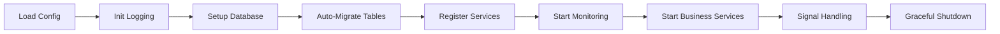

<div align="center">

# 🥚 EggyByte Core

**Enterprise-Grade Go Microservice Foundation for Modern Cloud-Native Applications**

[](https://go.dev/)
[](LICENSE)
[](https://github.com/eggybyte-technology/go-eggybyte-core/releases)
[](CONTRIBUTING.md)

[Features](#-core-features) • [Quick Start](#-quick-start) • [CLI Tool](#%EF%B8%8F-ebcctl-cli-tool) • [Documentation](#-documentation) • [Examples](#-examples)

---

</div>

## 📖 Overview

**EggyByte Core** is a powerful, production-ready Go foundation library designed for building scalable microservices with minimal boilerplate. Built on modern best practices and battle-tested patterns, it enables developers to focus on business logic while the framework handles infrastructure concerns.

### 🎯 Philosophy

- **Zero Boilerplate**: Start your entire service with a single function call
- **Convention over Configuration**: Sensible defaults with flexibility when needed
- **Developer Experience First**: Intuitive APIs and comprehensive tooling
- **Production Ready**: Built-in observability, health checks, and graceful shutdown
- **Cloud Native**: Kubernetes-ready with modern deployment patterns

---

## ✨ Core Features

<table>
<tr>
<td width="50%">

### 🚀 **Instant Bootstrap**
Start your entire microservice with one line of code. No configuration files, no complex setup—just pure productivity.

### 🔄 **Auto-Registration Magic**
Tables self-register and auto-migrate via `init()`. Write your models, import the package, and you're done.

### 📊 **Unified Monitoring**
Single port serves Prometheus metrics, health checks, liveness and readiness probes—Kubernetes-native from day one.

</td>
<td width="50%">

### 📝 **Structured Logging**
Context-aware logging with automatic request ID tracking. JSON or console output with configurable levels.

### 🗄️ **Database Integration**
Production-ready TiDB/MySQL support with connection pooling, transaction management, and GORM integration.

### 🛠️ **Code Generation**
Powerful CLI tool (`ebcctl`) generates production-ready backends, frontends, and complete full-stack projects.

</td>
</tr>
</table>

---

## 🚀 Quick Start

### Installation

#### Install as Library

```bash
go get github.com/eggybyte-technology/go-eggybyte-core
```

#### Install CLI Tool

```bash
go install github.com/eggybyte-technology/go-eggybyte-core/cmd/ebcctl@latest
```

Verify installation:

```bash
ebcctl version
```

---

### The 2-Line Microservice

```go
package main

import (
    "github.com/eggybyte-technology/go-eggybyte-core/pkg/config"
    "github.com/eggybyte-technology/go-eggybyte-core/pkg/core"
    "github.com/eggybyte-technology/go-eggybyte-core/pkg/log"
)

func main() {
    cfg := &config.Config{}
    config.MustReadFromEnv(cfg)

    if err := core.Bootstrap(cfg); err != nil {
        log.Fatal("Bootstrap failed", log.Field{Key: "error", Value: err})
    }
}
```

**That's it!** Your service now has:

<table>
<tr>
<td>✅ Structured logging</td>
<td>✅ Request ID tracking</td>
<td>✅ Graceful shutdown</td>
</tr>
<tr>
<td>✅ Health checks (/healthz)</td>
<td>✅ Liveness probe (/livez)</td>
<td>✅ Readiness probe (/readyz)</td>
</tr>
<tr>
<td>✅ Prometheus metrics (/metrics)</td>
<td>✅ Database pooling</td>
<td>✅ Auto table migration</td>
</tr>
</table>

---

## 📦 Architecture

### Module Overview

```
go-eggybyte-core/
├── 🎯 pkg/core/         Bootstrap orchestrator & service lifecycle
├── ⚙️  pkg/config/      Environment-based configuration management
├── 📝 pkg/log/          Structured logging with context propagation
├── 🗄️  pkg/db/          Database with auto-registration & pooling
├── 🚀 pkg/service/      Service launcher & graceful shutdown
├── 📊 pkg/monitoring/   Unified metrics & health endpoints
├── 🛠️  cmd/ebcctl/      CLI tool for code generation
├── 📚 docs/             Comprehensive documentation
├── 🎯 examples/         Practical examples and demos
├── ⚙️  configs/         Configuration templates
├── 🚀 deployments/      Docker and Kubernetes deployment configs
└── 🔧 scripts/          Build and deployment automation
```

### Bootstrap Flow



---

## 🗄️ Database with Auto-Registration

### Define Your Model

```go
package repositories

import (
    "context"
    "gorm.io/gorm"
    "github.com/eggybyte-technology/go-eggybyte-core/pkg/db"
)

type User struct {
    ID    uint   `gorm:"primaryKey"`
    Email string `gorm:"uniqueIndex;not null"`
    Name  string
}

type UserRepository struct {
    db *gorm.DB
}

func (r *UserRepository) TableName() string {
    return "users"
}

func (r *UserRepository) InitTable(ctx context.Context, db *gorm.DB) error {
    r.db = db
    return db.WithContext(ctx).AutoMigrate(&User{})
}

// Magic: Auto-register on import!
func init() {
    db.RegisterRepository(&UserRepository{})
}
```

### Use Your Repository

```go
import _ "myservice/internal/repositories" // Triggers auto-registration!

func main() {
    cfg := &config.Config{}
    config.MustReadFromEnv(cfg)

    core.Bootstrap(cfg) // Tables created automatically

    db := db.GetDB()
    var users []User
    db.Find(&users)
}
```

---

## 🛠️ ebcctl CLI Tool

The `ebcctl` command-line tool accelerates development through intelligent code generation.

### Create a Backend Microservice

```bash
ebcctl init backend user-service
```

**Generated structure:**

```
user-service/
├── cmd/main.go              # Bootstrap integration
├── internal/
│   ├── handlers/            # HTTP/gRPC handlers
│   ├── services/            # Business logic
│   └── repositories/        # Data access
├── go.mod                   # With core dependency
├── README.md                # Complete documentation
├── ENV.md                   # Configuration guide
├── Dockerfile               # Container ready
└── .gitignore               # Best practices
```

### Create a Flutter Frontend

```bash
ebcctl init frontend eggybyte-app
```

### Create a Full-Stack Project

```bash
ebcctl init project eggybyte-platform
```

**Generated structure:**

```
eggybyte-platform/
├── backend/
│   └── services/
│       ├── auth/            # Authentication service
│       └── user/            # User management service
├── frontend/                # Flutter application
├── api/                     # Shared protobuf definitions
├── Makefile                 # Unified build management
├── docker-compose.yml       # Local development
└── README.md                # Project documentation
```

### Generate Repository Code

```bash
cd my-service
ebcctl new repo order
```

Generates `internal/repositories/order_repository.go` with:
- Model definition
- CRUD operations
- Auto-registration
- Complete documentation

### Command Reference

| Command | Description | Example |
|---------|-------------|---------|
| `ebcctl init backend <name>` | Create backend microservice | `ebcctl init backend payment-service` |
| `ebcctl init frontend <name>` | Create Flutter project | `ebcctl init frontend mobile-app` |
| `ebcctl init project <name>` | Create full-stack project | `ebcctl init project eggybyte-platform` |
| `ebcctl new repo <model>` | Generate repository | `ebcctl new repo order` |
| `ebcctl version` | Show version | `ebcctl version` |

---

## ⚙️ Configuration

All configuration is managed through environment variables—no config files needed.

### Core Configuration

```bash
# Service Identity
SERVICE_NAME=user-service
ENVIRONMENT=production

# Network
PORT=8080
METRICS_PORT=9090

# Logging
LOG_LEVEL=info          # debug | info | warn | error | fatal
LOG_FORMAT=json         # json | console

# Database (Optional)
DATABASE_DSN=user:pass@tcp(localhost:4000)/mydb?charset=utf8mb4&parseTime=True
DATABASE_MAX_OPEN_CONNS=100
DATABASE_MAX_IDLE_CONNS=10

# Kubernetes Config Watch (Optional)
ENABLE_K8S_CONFIG_WATCH=false
K8S_NAMESPACE=default
K8S_CONFIGMAP_NAME=my-service-config
```

---

## 📊 Built-in Monitoring

### Unified Monitoring Server

All monitoring endpoints served on **port 9090** for Kubernetes compatibility:

| Endpoint | Purpose | Response |
|----------|---------|----------|
| `GET /metrics` | Prometheus metrics | Text format |
| `GET /healthz` | Combined health check | JSON status |
| `GET /livez` | Liveness probe | HTTP 200 |
| `GET /readyz` | Readiness probe | HTTP 200/503 |

### Health Check Response

```json
{
  "status": true,
  "checks": {
    "database": "OK",
    "redis": "OK",
    "external-api": "OK"
  }
}
```

### Prometheus Metrics

Auto-exposed metrics include:
- Go runtime (goroutines, memory, GC)
- HTTP request metrics (duration, status codes)
- Custom application metrics
- Database connection pool stats

---

## 📝 Logging

### Structured Logging

```go
import "github.com/eggybyte-technology/go-eggybyte-core/pkg/log"

log.Info("User created",
    log.Field{Key: "user_id", Value: userID},
    log.Field{Key: "email", Value: email},
)

log.Error("Payment failed",
    log.Field{Key: "order_id", Value: orderID},
    log.Field{Key: "error", Value: err.Error()},
)
```

### Context-Aware Logging

```go
// Attach logger to context
ctx, logger := log.WithLogger(ctx, "",
    log.Field{Key: "user_id", Value: userID},
)

// Request ID automatically included
log.InfoContext(ctx, "Processing request")
log.ErrorContext(ctx, "Request failed", log.Field{Key: "error", Value: err})
```

---

## 🎯 Service Implementation

### Implement Service Interface

```go
type HTTPServer struct {
    port   int
    server *http.Server
}

func (s *HTTPServer) Start(ctx context.Context) error {
    s.server = &http.Server{Addr: fmt.Sprintf(":%d", s.port)}

    errCh := make(chan error, 1)
    go func() {
        errCh <- s.server.ListenAndServe()
    }()

    select {
    case err := <-errCh:
        return err
    case <-ctx.Done():
        return s.Stop(context.Background())
    }
}

func (s *HTTPServer) Stop(ctx context.Context) error {
    return s.server.Shutdown(ctx)
}
```

### Register with Bootstrap

```go
func main() {
    cfg := &config.Config{}
    config.MustReadFromEnv(cfg)

    httpServer := NewHTTPServer(cfg.Port)
    grpcServer := NewGRPCServer(9090)

    core.Bootstrap(cfg, httpServer, grpcServer)
}
```

---

## 🧪 Testing

### Unit Testing with Mock Database

```go
func TestUserRepository(t *testing.T) {
    db, err := gorm.Open(sqlite.Open(":memory:"), &gorm.Config{})
    require.NoError(t, err)

    repo := &UserRepository{}
    err = repo.InitTable(context.Background(), db)
    require.NoError(t, err)

    user := &User{Email: "test@example.com", Name: "Test User"}
    result := repo.db.Create(user)
    assert.NoError(t, result.Error)
    assert.NotZero(t, user.ID)
}
```

---

## 🔧 Advanced Usage

### Custom Health Checkers

```go
type DatabaseHealthChecker struct {
    db *gorm.DB
}

func (d *DatabaseHealthChecker) Name() string {
    return "database"
}

func (d *DatabaseHealthChecker) Check(ctx context.Context) error {
    sqlDB, err := d.db.DB()
    if err != nil {
        return err
    }
    return sqlDB.PingContext(ctx)
}

// Register with health service
healthService.AddChecker(&DatabaseHealthChecker{db: db.GetDB()})
```

### Custom Initializers

```go
type CacheInitializer struct {
    redisAddr string
}

func (c *CacheInitializer) Init(ctx context.Context) error {
    log.Info("Initializing cache", log.Field{Key: "addr", Value: c.redisAddr})
    // Setup Redis connection
    return nil
}

// Register with launcher
launcher.AddInitializer(&CacheInitializer{redisAddr: "localhost:6379"})
```

---

## 📚 Documentation

### Official Resources

- **[Getting Started Guide](docs/GETTING_STARTED.md)** - Step-by-step tutorials
- **[API Reference](docs/API_REFERENCE.md)** - Complete API documentation
- **[Architecture Guide](docs/ARCHITECTURE.md)** - Design patterns and best practices
- **[Migration Guide](docs/MIGRATION.md)** - Upgrading from other frameworks

### Examples

- **[Demo Platform](docs/examples/demo-platform/)** - Complete full-stack example
- **[Microservice Examples](docs/examples/EXAMPLES.md)** - Common patterns and use cases

### Configuration Templates

- **[Configuration Template](configs/templates/config.yaml)** - Complete configuration example
- **[Docker Deployment](deployments/docker/)** - Docker and Docker Compose configurations
- **[Kubernetes Deployment](deployments/kubernetes/)** - Kubernetes manifests and configs

### Build and Deployment

- **[Build Script](scripts/build/build.sh)** - Automated build process
- **[Deploy Script](scripts/deploy/deploy.sh)** - Kubernetes deployment automation
- **[Makefile](Makefile)** - Unified build and development commands

---

## 💡 Best Practices

1. **Always use context** - Pass context through all layers for tracing and cancellation
2. **Log with structured fields** - Use `log.Field` instead of string formatting
3. **Register repositories in init()** - Enable automatic table migration
4. **Keep methods under 50 lines** - Follow EggyByte code quality standards
5. **Document public APIs** - Write comprehensive English comments
6. **Use ebcctl for consistency** - Generate code scaffolds with standardized structure

---

## 🤝 Contributing

We welcome contributions! Please follow these guidelines:

1. **Code Quality Standards**
   - All public APIs must have English comments
   - Methods must be under 50 lines
   - Follow Go best practices and conventions

2. **Testing Requirements**
   - Run `go test ./...` before submitting
   - Ensure `go build ./...` succeeds
   - Add tests for new features

3. **Pull Request Process**
   - Fork the repository
   - Create a feature branch
   - Submit PR with clear description
   - Ensure CI checks pass

See [CONTRIBUTING.md](CONTRIBUTING.md) for detailed guidelines.

---

## 📋 Changelog

See [CHANGES.md](CHANGES.md) for version history and release notes.

**Latest Release**: v1.0.0 - [Release Notes](RELEASE_NOTES_v1.0.0.md)

---

## 📄 License

This project is licensed under the MIT License - see the [LICENSE](LICENSE) file for details.

---

## 📞 Support

Need help? We're here for you:

- 🐛 **Bug Reports**: [GitHub Issues](https://github.com/eggybyte-technology/go-eggybyte-core/issues)
- 💬 **Questions**: [GitHub Discussions](https://github.com/eggybyte-technology/go-eggybyte-core/discussions)
- 📖 **Documentation**: See `/docs` directory
- ✉️ **Email**: support@eggybyte.com

---

## 🌟 Why EggyByte Core?

<table>
<tr>
<td width="33%" align="center">

### ⚡ **Lightning Fast**
From idea to production in minutes, not days. Our CLI generates complete, production-ready projects instantly.

</td>
<td width="33%" align="center">

### 🛡️ **Battle Tested**
Used in production by EggyByte microservices. Proven reliability and performance at scale.

</td>
<td width="33%" align="center">

### 🎓 **Developer Friendly**
Intuitive APIs, comprehensive docs, and sensible defaults. Focus on features, not infrastructure.

</td>
</tr>
</table>

---

<div align="center">

### Built with ❤️ by EggyByte Technology

**[⭐ Star us on GitHub](https://github.com/eggybyte-technology/go-eggybyte-core)** | **[📖 Read the Docs](docs/)** | **[🚀 Get Started](#-quick-start)**

</div>
