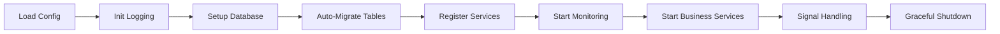

# 🥚 EggyByte Core

**Enterprise-Grade Go Microservice Foundation Library**

[](https://go.dev/)
[](LICENSE)
[](https://github.com/eggybyte-technology/go-eggybyte-core/releases/tag/v0.0.1)
[](https://pkg.go.dev/github.com/eggybyte-technology/go-eggybyte-core)
[](coverage.html)
[](https://goreportcard.com/report/github.com/eggybyte-technology/go-eggybyte-core)
[](https://github.com/eggybyte-technology/go-eggybyte-core/actions)
[](https://github.com/eggybyte-technology/go-eggybyte-core/actions)

---

## 📖 Overview

**EggyByte Core** is a powerful, production-ready Go foundation library designed for building scalable microservices with minimal boilerplate. Built on modern best practices and battle-tested patterns, it enables developers to focus on business logic while the framework handles infrastructure concerns.

### 🎯 Project Identity

**EggyByte Core** is a **pure Go library** that provides foundational infrastructure components for microservice development. It does **not** include CLI tools, code generation, or deployment configurations - those are handled by separate projects.

### 🔗 Related Projects

- **[ebcctl](https://github.com/eggybyte-technology/ebcctl)** - Standalone CLI tool for project management and code generation
- **[go-eggybyte-core](https://github.com/eggybyte-technology/go-eggybyte-core)** - This library (pure Go microservice foundation)

### 🎯 Philosophy

- **Zero Boilerplate**: Start your entire service with a single function call
- **Convention over Configuration**: Sensible defaults with flexibility when needed
- **Developer Experience First**: Intuitive APIs and comprehensive tooling
- **Production Ready**: Built-in observability, health checks, and graceful shutdown
- **Cloud Native**: Kubernetes-ready with modern deployment patterns
- **Modern Go Standards**: Follows Go community best practices and conventions

---

## ✨ Core Features

### 🚀 **Instant Bootstrap**
Start your entire microservice with one line of code. No configuration files, no complex setup—just pure productivity.

### 🔄 **Auto-Registration Magic**
Tables self-register and auto-migrate via `init()`. Write your models, import the package, and you're done.

### 📊 **Unified Monitoring**
Single port serves Prometheus metrics, health checks, liveness and readiness probes—Kubernetes-native from day one.

### 📝 **Structured Logging**
Context-aware logging with automatic request ID tracking. JSON or console output with configurable levels.

### 🗄️ **Database Integration**
Production-ready MySQL/TiDB support with connection pooling, transaction management, and GORM integration.

### 🛠️ **Extensible Architecture**
Modular design with clear interfaces for easy extension and customization. Built-in support for custom health checkers, initializers, and service implementations.

---

## 🚀 Quick Start

### Installation

```bash
go get github.com/eggybyte-technology/go-eggybyte-core
```

### The 2-Line Microservice

```go
package main

import (
    "github.com/eggybyte-technology/go-eggybyte-core/pkg/config"
    "github.com/eggybyte-technology/go-eggybyte-core/pkg/core"
    "github.com/eggybyte-technology/go-eggybyte-core/pkg/log"
)

func main() {
    cfg := &config.Config{}
    config.MustReadFromEnv(cfg)

    if err := core.Bootstrap(cfg); err != nil {
        log.Fatal("Bootstrap failed", log.Field{Key: "error", Value: err})
    }
}
```

**That's it!** Your service now has:

- ✅ Structured logging
- ✅ Request ID tracking
- ✅ Graceful shutdown
- ✅ Health checks (port 8081: /healthz, /livez, /readyz)
- ✅ Prometheus metrics (port 9091: /metrics)
- ✅ Database pooling
- ✅ Auto table migration
- ✅ Business HTTP server (port 8080, if enabled)
- ✅ Business gRPC server (port 9090, if enabled)

---

## 📦 Architecture

### Module Overview

```
go-eggybyte-core/
├── 🎯 pkg/core/         Bootstrap orchestrator & service lifecycle
├── ⚙️  pkg/config/      Environment-based configuration management
├── 📝 pkg/log/          Structured logging with context propagation
├── 🗄️  pkg/db/          Database with auto-registration & pooling
├── 🚀 pkg/service/      Service launcher & graceful shutdown
├── 🌐 pkg/server/       HTTP & gRPC business servers
├── 📊 pkg/monitoring/   Unified health checks & Prometheus metrics
└── 📚 docs/             Comprehensive documentation
```

### Bootstrap Flow



---

## 🗄️ Database with Auto-Registration

### Define Your Model

```go
package repositories

import (
    "context"
    "gorm.io/gorm"
    "github.com/eggybyte-technology/go-eggybyte-core/pkg/db"
)

type User struct {
    ID    uint   `gorm:"primaryKey"`
    Email string `gorm:"uniqueIndex;not null"`
    Name  string
}

type UserRepository struct {
    db *gorm.DB
}

func (r *UserRepository) TableName() string {
    return "users"
}

func (r *UserRepository) InitTable(ctx context.Context, db *gorm.DB) error {
    r.db = db
    return db.WithContext(ctx).AutoMigrate(&User{})
}

// Magic: Auto-register on import!
func init() {
    db.RegisterRepository(&UserRepository{})
}
```

### Use Your Repository

```go
import _ "myservice/internal/repositories" // Triggers auto-registration!

func main() {
    cfg := &config.Config{}
    config.MustReadFromEnv(cfg)

    core.Bootstrap(cfg) // Tables created automatically

    db := db.GetDB()
    var users []User
    db.Find(&users)
}
```

---

## ⚙️ Configuration

All configuration is managed through environment variables—no config files needed.

### Core Configuration

```bash
# Service Identity
SERVICE_NAME=user-service
ENVIRONMENT=production

# Business Server Ports
BUSINESS_HTTP_PORT=8080        # HTTP API server port
BUSINESS_GRPC_PORT=9090        # gRPC API server port

# Infrastructure Service Ports
HEALTH_CHECK_PORT=8081         # Health check endpoints port
METRICS_PORT=9091              # Prometheus metrics port

# Service Enable Flags
ENABLE_BUSINESS_HTTP=true      # Enable HTTP server
ENABLE_BUSINESS_GRPC=true      # Enable gRPC server
ENABLE_HEALTH_CHECK=true       # Enable health check service
ENABLE_METRICS=true            # Enable metrics service

# Logging
LOG_LEVEL=info                 # debug | info | warn | error | fatal
LOG_FORMAT=json                # json | console

# Database (Optional)
DATABASE_DSN=user:pass@tcp(localhost:3306)/mydb?charset=utf8mb4&parseTime=True
DATABASE_MAX_OPEN_CONNS=100
DATABASE_MAX_IDLE_CONNS=10

# Kubernetes Config Watch (Optional)
ENABLE_K8S_CONFIG_WATCH=false
K8S_NAMESPACE=default
K8S_CONFIGMAP_NAME=my-service-config
```

---

## 📊 Built-in Monitoring

### Separate Health Check and Metrics Services

Health check and metrics services run on separate ports for better security and monitoring isolation:

#### Health Check Service (Port 8081)

| Endpoint | Purpose | Response |
|----------|---------|----------|
| `GET /healthz` | Combined health check | JSON status |
| `GET /livez` | Liveness probe | HTTP 200 |
| `GET /readyz` | Readiness probe | HTTP 200/503 |

#### Metrics Service (Port 9091)

| Endpoint | Purpose | Response |
|----------|---------|----------|
| `GET /metrics` | Prometheus metrics | Text format |

### Health Check Response

```json
{
  "status": true,
  "checks": {
    "database": "OK",
    "external-api": "OK"
  }
}
```

### Prometheus Metrics

Auto-exposed metrics include:
- Go runtime (goroutines, memory, GC)
- HTTP request metrics (duration, status codes)
- Custom application metrics
- Database connection pool stats

---

## 📝 Logging

### Structured Logging

```go
import "github.com/eggybyte-technology/go-eggybyte-core/pkg/log"

log.Info("User created",
    log.Field{Key: "user_id", Value: userID},
    log.Field{Key: "email", Value: email},
)

log.Error("Payment failed",
    log.Field{Key: "order_id", Value: orderID},
    log.Field{Key: "error", Value: err.Error()},
)
```

### Context-Aware Logging

```go
// Attach logger to context
ctx, logger := log.WithLogger(ctx, "",
    log.Field{Key: "user_id", Value: userID},
)

// Request ID automatically included
log.InfoContext(ctx, "Processing request")
log.ErrorContext(ctx, "Request failed", log.Field{Key: "error", Value: err})
```

---

## 🎯 Service Implementation

### Using Built-in Server Modules

EggyByte Core provides ready-to-use HTTP and gRPC server implementations:

```go
import (
    "github.com/eggybyte-technology/go-eggybyte-core/pkg/server"
    "github.com/eggybyte-technology/go-eggybyte-core/pkg/config"
    "github.com/eggybyte-technology/go-eggybyte-core/pkg/core"
)

func main() {
    cfg := &config.Config{}
    config.MustReadFromEnv(cfg)

    // Create HTTP server for REST APIs
    httpServer := server.NewHTTPServer(":8080")
    httpServer.HandleFunc("/api/v1/users", userHandler)
    httpServer.HandleFunc("/api/v1/orders", orderHandler)

    // Create gRPC server for RPC APIs
    grpcServer := server.NewGRPCServer(":9090")
    grpcServer.EnableReflection() // Enable for development
    pb.RegisterUserServiceServer(grpcServer.GetServer(), userService)
    pb.RegisterOrderServiceServer(grpcServer.GetServer(), orderService)

    // Bootstrap with business servers
    core.Bootstrap(cfg, httpServer, grpcServer)
}
```

### Custom Service Implementation

For custom services, implement the Service interface:

```go
type CustomService struct {
    port   int
    server *http.Server
}

func (s *CustomService) Start(ctx context.Context) error {
    s.server = &http.Server{Addr: fmt.Sprintf(":%d", s.port)}

    errCh := make(chan error, 1)
    go func() {
        errCh <- s.server.ListenAndServe()
    }()

    select {
    case err := <-errCh:
        return err
    case <-ctx.Done():
        return s.Stop(context.Background())
    }
}

func (s *CustomService) Stop(ctx context.Context) error {
    return s.server.Shutdown(ctx)
}

// Register with Bootstrap
func main() {
    cfg := &config.Config{}
    config.MustReadFromEnv(cfg)

    customService := &CustomService{port: 8080}
    core.Bootstrap(cfg, customService)
}
```

---

## 🧪 Testing

### Unit Testing with Mock Database

```go
func TestUserRepository(t *testing.T) {
    db, err := gorm.Open(sqlite.Open(":memory:"), &gorm.Config{})
    require.NoError(t, err)

    repo := &UserRepository{}
    err = repo.InitTable(context.Background(), db)
    require.NoError(t, err)

    user := &User{Email: "test@example.com", Name: "Test User"}
    result := repo.db.Create(user)
    assert.NoError(t, result.Error)
    assert.NotZero(t, user.ID)
}
```

---

## 🔧 Advanced Usage

### Custom Health Checkers

```go
type DatabaseHealthChecker struct {
    db *gorm.DB
}

func (d *DatabaseHealthChecker) Name() string {
    return "database"
}

func (d *DatabaseHealthChecker) Check(ctx context.Context) error {
    sqlDB, err := d.db.DB()
    if err != nil {
        return err
    }
    return sqlDB.PingContext(ctx)
}

// Register with health service
healthService.AddChecker(&DatabaseHealthChecker{db: db.GetDB()})
```

### Custom Initializers

```go
type CacheInitializer struct {
    redisAddr string
}

func (c *CacheInitializer) Init(ctx context.Context) error {
    log.Info("Initializing cache", log.Field{Key: "addr", Value: c.redisAddr})
    // Setup Redis connection
    return nil
}

// Register with launcher
launcher.AddInitializer(&CacheInitializer{redisAddr: "localhost:6379"})
```

---

## 📚 Documentation

### Official Resources

- **[Getting Started Guide](docs/GETTING_STARTED.md)** - Step-by-step tutorials
- **[API Reference](docs/API_REFERENCE.md)** - Complete API documentation
- **[Architecture Guide](docs/ARCHITECTURE.md)** - Design patterns and best practices
- **[Migration Guide](docs/MIGRATION.md)** - Upgrading from other frameworks

---

## 🛠️ Development

### Prerequisites

- Go 1.25.1 or later
- Make (for build automation)
- golangci-lint (for code quality)

### Getting Started

```bash
# Clone the repository
git clone https://github.com/eggybyte-technology/go-eggybyte-core.git
cd go-eggybyte-core

# Install dependencies
make deps

# Run tests
make test

# Run linting
make lint

# Run all checks
make check
```

### Project Structure

```
go-eggybyte-core/
├── pkg/                    # Public library packages
│   ├── core/              # Bootstrap orchestrator
│   ├── config/            # Configuration management
│   ├── log/               # Structured logging
│   ├── db/                # Database utilities
│   ├── monitoring/        # Health checks & metrics
│   ├── server/            # HTTP & gRPC servers
│   └── service/           # Service lifecycle
├── docs/                  # Documentation
├── internal/              # Internal packages (not exported)
├── .golangci.yml          # Linting configuration
├── .gitignore             # Git ignore rules
├── Makefile               # Build automation
└── README.md              # This file
```

### Code Quality

The project follows strict code quality standards:

- **100% English Comments**: All public APIs must have English documentation
- **Method Length Limit**: Public methods ≤50 lines
- **Test Coverage**: ≥90% coverage for core functionality
- **Linting**: golangci-lint with comprehensive rules
- **Formatting**: gofmt and goimports enforcement

### Contributing

1. Fork the repository
2. Create a feature branch
3. Make your changes following the coding standards
4. Add tests for new functionality
5. Run `make check` to ensure quality
6. Submit a pull request

---

## 💡 Best Practices

1. **Always use context** - Pass context through all layers for tracing and cancellation
2. **Log with structured fields** - Use `log.Field` instead of string formatting
3. **Register repositories in init()** - Enable automatic table migration
4. **Keep methods under 50 lines** - Follow EggyByte code quality standards
5. **Document public APIs** - Write comprehensive English comments
6. **Follow Go best practices** - Use standard Go patterns and conventions for maintainable code

---

## 📋 Changelog

See [CHANGELOG.md](CHANGELOG.md) for version history and release notes.

---

## 📄 License

This project is licensed under the MIT License - see the [LICENSE](LICENSE) file for details.

---

## 🌟 Why EggyByte Core?

### ⚡ **Lightning Fast**
From idea to production in minutes, not days. Minimal boilerplate with maximum functionality out of the box.

### 🛡️ **Battle Tested**
Used in production by EggyByte microservices. Proven reliability and performance at scale.

### 🎓 **Developer Friendly**
Intuitive APIs, comprehensive docs, and sensible defaults. Focus on features, not infrastructure.

---

<div align="center">

### Built with ❤️ by EggyByte Technology

**[⭐ Star us on GitHub](https://github.com/eggybyte-technology/go-eggybyte-core)** | **[📖 Read the Docs](docs/)** | **[🚀 Get Started](#-quick-start)** | **[📋 Changelog](CHANGELOG.md)**

---

## 📄 License

This project is licensed under the Apache License 2.0 - see the [LICENSE](LICENSE) file for details.

## 🤝 Contributing

We welcome contributions! Please see our [Contributing Guidelines](CONTRIBUTING.md) for details on how to get started.

## 📞 Support

- 📧 Email: [support@eggybyte.com](mailto:support@eggybyte.com)
- 💬 Discord: [Join our community](https://discord.gg/eggybyte)
- 📖 Documentation: [docs.eggybyte.com](https://docs.eggybyte.com)
- 🐛 Issues: [GitHub Issues](https://github.com/eggybyte-technology/go-eggybyte-core/issues)

## 🏆 Acknowledgments

- Thanks to the Go community for the excellent ecosystem
- Inspired by modern microservice patterns and best practices
- Built with love for developers who value simplicity and reliability

</div>