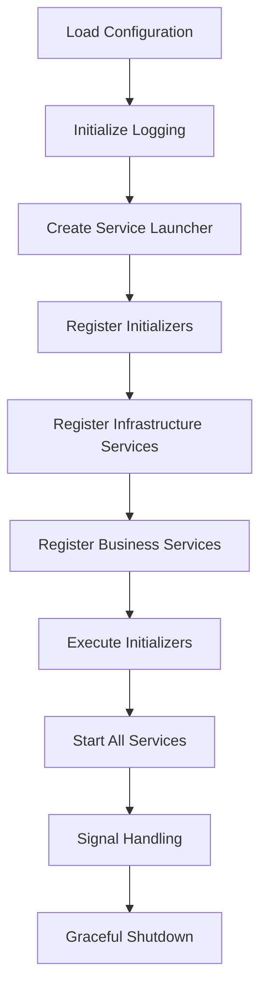

# Architecture Guide

## Overview

EggyByte Core is designed as a modular, enterprise-grade foundation library for Go microservices. It follows modern cloud-native patterns and provides a comprehensive set of tools for building scalable, maintainable services.

## Core Principles

### 1. Convention over Configuration
- Sensible defaults for all components
- Minimal configuration required
- Automatic initialization and registration

### 2. Modular Design
- Independent, loosely coupled modules
- Clear separation of concerns
- Easy to extend and customize

### 3. Production Ready
- Built-in observability and monitoring
- Graceful shutdown handling
- Comprehensive error handling

### 4. Developer Experience
- Simple APIs with minimal boilerplate
- Comprehensive documentation
- Powerful CLI tools for code generation

## Architecture Components

### Core Module (`pkg/core`)
The central orchestrator that coordinates all other modules during service startup and shutdown.

**Key Components:**
- `Bootstrap()` - Single entry point for service initialization
- Service lifecycle management
- Dependency injection and configuration

**Usage:**
```go
cfg := &config.Config{}
config.MustReadFromEnv(cfg)

if err := core.Bootstrap(cfg); err != nil {
    log.Fatal("Bootstrap failed", log.Field{Key: "error", Value: err})
}
```

### Configuration Module (`pkg/config`)
Unified configuration management with support for environment variables and Kubernetes ConfigMaps.

**Features:**
- Environment variable loading
- Kubernetes ConfigMap watching
- Thread-safe global configuration access
- Type-safe configuration structures

**Configuration Structure:**
```go
type Config struct {
    ServiceName string `envconfig:"SERVICE_NAME" required:"true"`
    Environment string `envconfig:"ENVIRONMENT" default:"development"`
    Port        int    `envconfig:"PORT" default:"8080"`
    // ... other fields
}
```

### Logging Module (`pkg/log`)
Structured logging with context propagation and multiple output formats.

**Features:**
- Structured JSON logging
- Context-aware logging with request IDs
- Configurable log levels and formats
- Integration with distributed tracing

**Usage:**
```go
log.Info("User created",
    log.Field{Key: "user_id", Value: userID},
    log.Field{Key: "email", Value: email},
)
```

### Database Module (`pkg/db`)
Database abstraction layer with automatic table migration and connection pooling.

**Features:**
- MySQL/TiDB compatibility
- Automatic table migration via repository registration
- Connection pooling and health checks
- GORM integration with custom logging

**Repository Pattern:**
```go
type UserRepository struct {
    db *gorm.DB
}

func (r *UserRepository) TableName() string {
    return "users"
}

func (r *UserRepository) InitTable(ctx context.Context, db *gorm.DB) error {
    return db.WithContext(ctx).AutoMigrate(&User{})
}

// Auto-registration
func init() {
    db.RegisterRepository(&UserRepository{})
}
```

### Cache Module (`pkg/cache`)
Memcached integration with high-level cache operations.

**Features:**
- Memcached client with connection pooling
- High-level cache operations (Get, Set, Delete, Exists)
- Automatic connection management
- Health checks and monitoring

**Usage:**
```go
cacheService := cache.NewCacheService(cache.GetClient())
err := cacheService.Set(ctx, "key", []byte("value"), time.Minute)
```

### Service Module (`pkg/service`)
Service lifecycle management with graceful shutdown and concurrent execution.

**Interfaces:**
- `Service` - Start/Stop lifecycle
- `Initializer` - Pre-startup initialization
- `Launcher` - Orchestrates service execution

**Service Implementation:**
```go
type HTTPServer struct {
    port   int
    server *http.Server
}

func (s *HTTPServer) Start(ctx context.Context) error {
    // Start HTTP server
}

func (s *HTTPServer) Stop(ctx context.Context) error {
    // Graceful shutdown
}
```

### Monitoring Module (`pkg/monitoring`)
Unified monitoring service providing metrics, health checks, and observability endpoints.

**Endpoints:**
- `/metrics` - Prometheus metrics
- `/healthz` - Combined health check
- `/livez` - Liveness probe
- `/readyz` - Readiness probe

**Health Check Implementation:**
```go
type DatabaseHealthChecker struct {
    db *gorm.DB
}

func (d *DatabaseHealthChecker) Name() string {
    return "database"
}

func (d *DatabaseHealthChecker) Check(ctx context.Context) error {
    sqlDB, err := d.db.DB()
    if err != nil {
        return err
    }
    return sqlDB.PingContext(ctx)
}
```

## Service Bootstrap Flow



### Bootstrap Phases

1. **Configuration Loading** - Load from environment variables
2. **Logging Initialization** - Setup structured logging
3. **Service Launcher Creation** - Create lifecycle manager
4. **Initializer Registration** - Register database, cache, etc.
5. **Infrastructure Service Registration** - Register monitoring services
6. **Business Service Registration** - Register application services
7. **Initializer Execution** - Run all initializers sequentially
8. **Service Startup** - Start all services concurrently
9. **Signal Handling** - Handle shutdown signals
10. **Graceful Shutdown** - Stop all services gracefully

## Design Patterns

### 1. Repository Pattern
Automatic table migration through repository registration:

```go
// Repository implements db.Repository interface
type UserRepository struct {
    db *gorm.DB
}

func (r *UserRepository) TableName() string {
    return "users"
}

func (r *UserRepository) InitTable(ctx context.Context, db *gorm.DB) error {
    return db.WithContext(ctx).AutoMigrate(&User{})
}

// Auto-registration in init()
func init() {
    db.RegisterRepository(&UserRepository{})
}
```

### 2. Service Interface Pattern
Consistent service lifecycle management:

```go
type Service interface {
    Start(ctx context.Context) error
    Stop(ctx context.Context) error
}
```

### 3. Initializer Pattern
Pre-startup initialization for infrastructure components:

```go
type Initializer interface {
    Init(ctx context.Context) error
}
```

### 4. Configuration Pattern
Environment-driven configuration with sensible defaults:

```go
type Config struct {
    ServiceName string `envconfig:"SERVICE_NAME" required:"true"`
    Port        int    `envconfig:"PORT" default:"8080"`
    LogLevel    string `envconfig:"LOG_LEVEL" default:"info"`
}
```

## Best Practices

### 1. Service Structure
- Keep services focused on single responsibility
- Use dependency injection for testability
- Implement graceful shutdown

### 2. Error Handling
- Use structured error types
- Log errors with context
- Return meaningful error messages

### 3. Configuration
- Use environment variables for configuration
- Provide sensible defaults
- Validate configuration at startup

### 4. Logging
- Use structured logging with fields
- Include request IDs for tracing
- Log at appropriate levels

### 5. Database Operations
- Use transactions for multi-step operations
- Implement proper error handling
- Use connection pooling

### 6. Caching
- Cache frequently accessed data
- Set appropriate expiration times
- Handle cache misses gracefully

## Extension Points

### Custom Initializers
Add custom initialization logic:

```go
type CustomInitializer struct {
    config string
}

func (c *CustomInitializer) Init(ctx context.Context) error {
    // Custom initialization logic
    return nil
}

// Register with launcher
launcher.AddInitializer(&CustomInitializer{config: "value"})
```

### Custom Health Checkers
Add custom health checks:

```go
type CustomHealthChecker struct {
    service string
}

func (c *CustomHealthChecker) Name() string {
    return c.service
}

func (c *CustomHealthChecker) Check(ctx context.Context) error {
    // Custom health check logic
    return nil
}
```

### Custom Services
Implement custom services:

```go
type CustomService struct {
    port int
}

func (s *CustomService) Start(ctx context.Context) error {
    // Start custom service
    return nil
}

func (s *CustomService) Stop(ctx context.Context) error {
    // Stop custom service
    return nil
}
```

## Performance Considerations

### Database
- Use connection pooling
- Implement query optimization
- Use transactions appropriately
- Monitor database performance

### Caching
- Cache frequently accessed data
- Use appropriate cache keys
- Set reasonable expiration times
- Monitor cache hit rates

### Logging
- Use appropriate log levels
- Avoid logging sensitive data
- Use structured logging
- Monitor log volume

### Monitoring
- Expose relevant metrics
- Implement health checks
- Monitor resource usage
- Set up alerts

## Security Considerations

### Configuration
- Use environment variables for secrets
- Validate all configuration inputs
- Use secure defaults
- Rotate secrets regularly

### Database
- Use connection encryption
- Implement proper authentication
- Use least privilege principles
- Monitor database access

### Logging
- Avoid logging sensitive data
- Use structured logging
- Implement log rotation
- Monitor log access

### Network
- Use TLS for all communications
- Implement proper authentication
- Use network policies
- Monitor network traffic

## Troubleshooting

### Common Issues

1. **Database Connection Failures**
   - Check DSN format
   - Verify network connectivity
   - Check authentication credentials
   - Monitor connection pool usage

2. **Cache Connection Failures**
   - Check server addresses
   - Verify network connectivity
   - Check server configuration
   - Monitor connection pool usage

3. **Service Startup Failures**
   - Check configuration validity
   - Verify all dependencies
   - Check port availability
   - Review startup logs

4. **Performance Issues**
   - Monitor resource usage
   - Check database performance
   - Review cache hit rates
   - Analyze log patterns

### Debugging Tips

1. **Enable Debug Logging**
   ```bash
   export LOG_LEVEL=debug
   export LOG_FORMAT=console
   ```

2. **Check Health Endpoints**
   ```bash
   curl http://localhost:9090/healthz
   curl http://localhost:9090/readyz
   ```

3. **Monitor Metrics**
   ```bash
   curl http://localhost:9090/metrics
   ```

4. **Review Logs**
   - Check structured log fields
   - Look for error patterns
   - Monitor request IDs
   - Analyze performance metrics

## Migration Guide

### From Other Frameworks

1. **Replace Framework-Specific Code**
   - Remove framework-specific imports
   - Replace initialization code with `core.Bootstrap()`
   - Update configuration loading

2. **Update Service Structure**
   - Implement `Service` interface
   - Add graceful shutdown
   - Update error handling

3. **Migrate Configuration**
   - Convert to environment variables
   - Update configuration structure
   - Remove configuration files

4. **Update Dependencies**
   - Add EggyByte Core dependency
   - Remove framework dependencies
   - Update import paths

### Version Upgrades

1. **Review Changelog**
   - Check breaking changes
   - Review new features
   - Update configuration

2. **Update Dependencies**
   - Update Go version if required
   - Update dependency versions
   - Run `go mod tidy`

3. **Test Changes**
   - Run test suite
   - Test in staging environment
   - Monitor performance

4. **Deploy Gradually**
   - Deploy to staging first
   - Monitor metrics and logs
   - Deploy to production

## Contributing

### Code Standards
- Follow Go best practices
- Write comprehensive tests
- Document public APIs
- Use structured logging

### Pull Request Process
1. Fork the repository
2. Create a feature branch
3. Make your changes
4. Add tests
5. Update documentation
6. Submit pull request

### Development Setup
1. Clone the repository
2. Install dependencies
3. Run tests
4. Build the project
5. Test locally

For more information, see the [Contributing Guide](../CONTRIBUTING.md).